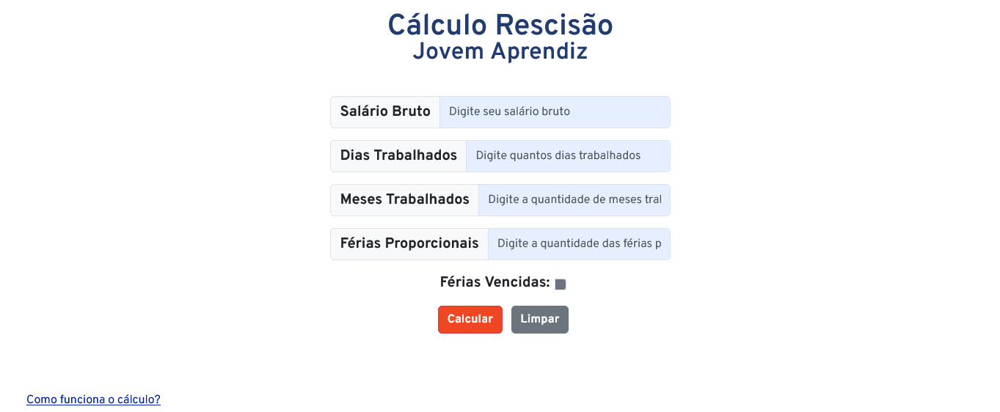

# Cálculo de Rescisão

Este projeto é uma aplicação web interativa que permite aos usuários calcular a rescisão trabalhista de forma simples e precisa. A ferramenta foi desenvolvida utilizando HTML, CSS e JavaScript e fornece uma interface amigável para a entrada de dados e exibição dos resultados.

## 🔥 Introdução
Para calcular a sua rescisão, por favor, forneça as seguintes informações:

    • Salário Bruto: Informe o valor total do seu salário bruto, ou seja, o valor acordado em contrato antes de quaisquer descontos.

    • Dias Trabalhados no Mês: Informe a quantidade de dias que você trabalhou no mês em que o contrato foi finalizado.
    Esse valor é necessário para calcular a parte proporcional do salário do mês.

    • Meses Trabalhados: Informe a quantidade total de meses que você trabalhou na empresa. Este valor será utilizado para calcular o décimo terceiro salário proporcional.

    • Férias Vencidas: Informe se possui férias vencidas, as férias vencidas são férias que ainda foram gozadas no período de um ano.

    • Férias Proporcionais: Informe a quantidade de férias proporcionais que você tem direito. Geralmente, isso é calculado com base nos meses trabalhados desde o seu último período aquisitivo de férias.

## ➕ Como os cálculos são feitos: 

    • Salário Proporcional: Calculamos o valor do salário referente aos dias trabalhados no mês da rescisão dividindo o salário bruto por 31 e multiplicando pelo número de dias trabalhados.

    • Décimo Terceiro Proporcional: Calculamos o valor do décimo terceiro proporcional dividindo o salário bruto por 12 e multiplicando pelo número de meses trabalhados no ano corrente.

    • Férias Vencidas: Se você tem férias vencidas (não gozadas), calculamos adicionando um terço ao valor do salário bruto (1/3 a mais do salário).

    • Férias Proporcionais: Calculamos as férias proporcionais dividindo o salário bruto por 12 e multiplicando pelo número de meses trabalhados desde o último período aquisitivo.

    • Descontos: Calculamos os descontos baseados em seu saldo de salário, no mês de demissão, e sobre o seu valor de Décimo 13º. Depois é somado ambos os valores e subtraído do seu total.

## 👀 Exibição dos Resultados:

    • A aplicação exibe os valores calculados de salário proporcional, décimo terceiro, férias vencidas (se aplicável) e férias proporcionais.

    • Exibe o valor total da rescisão, somando todos os componentes mencionados acima.

    • Exibe os descontos e o total liquído.

## 📦 Tecnologias usadas:
    • HTML para a estrutura da página.

    • CSS para o estilo e layout.

    • JavaScript para a lógica de cálculo e interatividade.
## 👷 Autores

* **Ingrid de Souza** - [IngridsSilveira](https://github.com/IngridsSilveira)